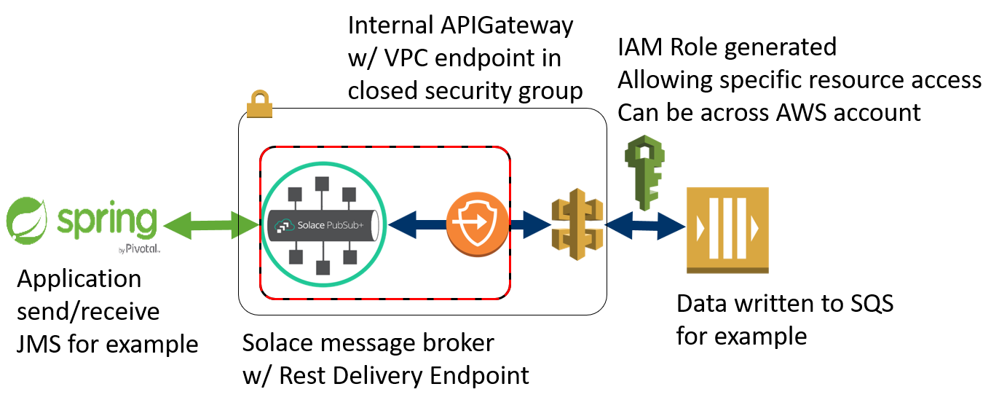
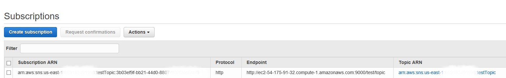

# solace-aws-service-integration 

## Synopsis

This repository provides a no code integration solution which allows applications connected to a Solace Event Mesh to interop with AWS data services.

Consider the following diagram:

It does not matter if the application communicates with the Solace broker in AWS via a REST POST or an AMQP, JMS or MQTT message, it can be sent automatically to AWS services and depending on the service asynchronously receive or poll for messages.

The Event Mesh is a clustered group of Solace PubSub+ Brokers that transparently, in real-time, route data events to any Service that is part of the Event Mesh. Solace PubSub+ Brokers (Appliances, Software and SolaceCloud) are connected to each other as a multi-connected mesh that to individual services (consumers or producers of data events) appears to be a single Event Broker. Events messages are seamlessly transported within the entire Solace Event Mesh regardless of where the event is created and where the process exists that has registered interested in consuming the event. Simply by having a Solace PubSub+ broker in AWS connected to the Event Mesh, the entire Event Mesh becomes aware of the registration request and will know how to securely route the appropriate events to and from AWS services.
This AWS integration solution allows any event from any service in the Solace Event Mesh to send to be captured in an SQS queue, SNS topic, S3 bucket or invoke a Lambda function or be ingested into a Kinesis stream. It does not matter which service in the Event Mesh created the event, the events are all potentially available to AWS services. There is no longer a requirement to code end applications to reach individual public cloud services.
This AWS integration also eliminates the need for bespoke bridges or gateways that need to be made resilient, maintained and operated. 

## Usage

### Detailed Topology Example

Breaking down the above diagram into its component parts:
1. End application - In this example a Spring app communicating with JMS is outside the scope of this solution and is assumed to pre-exist.  It would communicate with the Solace message broker in normal fashion.

2. Solace Message Broker - Can be optionally provided or defined within the solution.  Will terminate the application connection and deliver messages via Rest Delivery Endpoints to the APIGateway.

3. VPC Endpoint - Defined within solution, provides a private interface to the APIGateway from within the defined subnet only.

4. Security Group - Defined within solution.  Allows only the created Message Broker(s) to communicate with the APIGateway.  This is based on security group membership no IPs or other credentials.

5. APIGateway - Defined within solution. Converts the Solace provided message to a signed REST call formatted for the target downstream resource, (SQS, SNS, S3, Lambda, Kinesis).

6. IAM Role - Defined within solution. Allows read/write access to the specific downstream resource, can be across accounts.

7. AWS Resource.  In this example an SQS Queue is outside the scope of this solution and is assumed to pre-exist.  API gateway can write to a specific object or read from it.

### Minimum Resource Requirements
Below is the list of AWS resources that will be deployed by the Quick Start. Please consult the [Amazon VPC Limits](https://docs.aws.amazon.com/AmazonVPC/latest/UserGuide/VPC_Appendix_Limits.html ) page and ensure that your AWS region is within the limit range per resource before launching:

| Resource                   | Deploy |
|----------------------------|--------|
| VPCs                       |   1    |
| subnets                    |   1    |
| Running Instances          |   1    |
| API Gateways               |   1    |
| Endpoints                  |   1    |
| Security Groups            |   3    |

### Required IAM Roles
#### Default Group Policies
    AmazonEC2FullAccess
    AmazonS3FullAccess
#### Additional Policies
    AmazonAPIGatewayAdministration
    AmazonAPIGatewayPushToCloudWatchLogs
    AWSCloudFormationReadOnlyAccess
    IAMReadOnlyAccess
#### Additional individual permissions
    "cloudformation:CreateStack*",
    "cloudformation:DeleteStack",
    "iam:AddRoleToInstanceProfile",
    "iam:CreateInstanceProfile",
    "iam:CreateRole",
    "iam:CreatePolicy",
    "iam:PutRolePolicy",
    "iam:PassRole",
    "iam:DeleteRole",
    "iam:DeletePolicy",
    "iam:DeleteRolePolicy",
    "iam:DeleteInstanceProfile",
    "iam:RemoveRoleFromInstanceProfile",
    "logs:PutRetentionPolicy",
    "logs:DeleteLogGroup"

## Deploying solution
The solution is deployed via Cloud Formation templates.   It can either deploy the entire solution including Solace message broker and configure the rest delivery endpoints, set up the security group and endpoint as well as the APIGateway. Or, just deploy the AWS components and allow the administrator to configure an existing Solace message broker.

Deploying APIGateway components only.

Deploying complete solution including Solace message router.

  

### Launch option 1: Parameters for deploying only APIGateway

| Parameter label (name)     | Default   | Description                                                        |
|----------------------------|-----------|--------------------------------------------------------------------|
| Stack name                 | Solace-APIGW | Any globally unique name                                           |
| **Resource Parameters** | |                                                                     |
| Type of Resource (ResourceType) | _Requires_ _input_ | One of S3, SQS, SNS, Lambda, Kinesis, from picklist |
| ARN of Resource (ResourceARN) | _Requires_ _input_ | The actual resource ARN being writen to and read from, see below for further deployment details |
| **AWS Quick Start Configuration** | |                                                                     |
| Subnet IDs (SubnetID) | _Requires_ _input_ | Choose public subnet IDs in your existing VPC from this list (e.g., subnet-4b8d329f,subnet-bd73afc8,subnet-a01106c2), matching your deployment architecture. |
| VPC ID (VPCID)             | _Requires_ _input_ | Choose the ID of your existing VPC stack - for a value, refer to the `VPCID` in the "VPCStack"'s `Outputs` tab in the AWS CloudFormation view (e.g., vpc-0343606e). This VPC must exist with the proper configuration for Solace cluster access. |
| Quick Start S3 Bucket Name (QSS3BucketName) | solace-products | S3 bucket where the Quick Start templates and scripts are installed. Change this parameter to specify the S3 bucket name you’ve created for your copy of Quick Start assets, if you decide to customize or extend the Quick Start for your own use. |
| Quick Start S3 Key Prefix (QSS3KeyPrefix) | solace-aws-ha-quickstart/latest/ | Specifies the S3 folder for your copy of Quick Start assets. Change this parameter if you decide to customize or extend the Quick Start for your own use. |

### Launch option 2: Parameters for deploying APIGateway and Solace Message Broker

| Parameter label (name)     | Default   | Description                                                        |
|----------------------------|-----------|--------------------------------------------------------------------|
| Stack name                 | Solace-APIGW | Any globally unique name                                           |
| **Solace Parameters**      |           |                                                                    |
| CLI and SEMP SolOS admin password (AdminPassword)| _Requires_ _input_ | Password to allow Solace admin access to configure the message broker instances |
| Key Pair Name (KeyPairName) | _Requires_ _input_ | A new or an existing public/private key pair within the AWS Region, which allows you to connect securely to your instances after launch. |
| Instance Type (NodeInstanceType) | t2.large | The EC2 instance type for the Solace message broker The m series are recommended for production use.   The available CPU and memory of the selected machine type will limit the maximum connection scaling tier for the Solace message broker. For requirements, refer to the [Solace documentation](https://docs.solace.com/Solace-SW-Broker-Set-Up/Setting-Up-SW-Brokers.htm#Compare) |
| Security Groups for external access (SecurityGroupID) | _Requires_ _input_ | The ID of the security group in your existing VPC that is allowed to access the console and Data|

  

Select [next] after completing the parameters form to get to the "Options" screen.

Select [next] on the "Options" screen unless you want to add tags, use specific IAM roles, or blend in custom stacks.

Acknowledge that resources will be created and select [Create] in bottom right corner.

### Deploying SQS solution
The expected message pattern might be to send messages to a SQS queue and receive messages from an SQS queue.  In reality the message patterns will likely be:
1.  Send messages from Solace event mesh to a SQS queue.
2.  Poll an SQS queue for messages eligible for delivery and receive these messages.
3.  Delete each delivered message that has been successfully consumed.

If a message has been delivered but not yet deleted it moved from eligible for deliver to in-flight.  From here it can either be explicitly deleted with a delete message or moved back to eligible for delivery after deltee timeout, which is by default 15 seconds.

When sending and recieving messages to/from an SQS queue, you will need an existing queue.  The ARN for the queue can be found from the AWS console by looking at the SQS queue details and will be of the form:

    arn:aws:sqs:<aws region>:<aws accountId>:<queue name>

When sending messages that would go to the SQS queue, the binary attachment of the message will be sent AWS queue. Custom headers will not be passed to SQS.

When receiving messages from SQS queue, a request/reply pattern should be used if the sending protocol supports it.  The reply will include the message payload, message payload MD5 and the receiptID.  This receiptID needs to be the only element in the delete message body and needs to be sent within 15 seconds of the initial delivery or the message will be re-queued within SQS for delivery.  If the receiving protocol does not support request/reply, then a monitor application can async receive data generated from the polling and subsequently delete it.

Here is an example exchange pattern:

    Send Message
    pubSubTools/sdkperf_c -cip="${publicIp}" -ptl=solace-aws-service-integration/send -mr=1 -mn=1 -pal messageBody

    Receive Message
    pubSubTools/sdkperf_c -cip="${publicIp}" -stl=solace-aws-service-integration/receive/reply -ptl=solace-aws-service-integration/receive -prp=/reply -mr=1 -mn=1 -md

    Extract the ReceiptId from the received message receiptId and delete from queue
    pubSubTools/sdkperf_c -cip="${publicIp}" 
    -ptl=solace-aws-service-integration/delete -mr=1 -mn=1 -pal receiptId

### Deploying S3 solution
When sending and receiving to/from S3 bucket just use the bucket/object as the resource ARN.  Other aspects will be simular to SQS, you can write, read and delete, though there is no concept of "in-flight".  A read message, (object), will be imidiately eligible to be re-read.

It is possible to register a SNS subscription, described below, to be notified of changes to a S3 bucket so that you will know an object has changed. 

### Deploying SNS solution
he expected message pattern might be to asynchronously send and receive messages from an SNS Topic.  This is exactly how this integration works.  Sending messages will work in the same manor as SQS or S3.  The body of the Solace message will be written to the SNS topic.

To receive messages, you will need to subscribe the Solace message broker to the SNS topic.  This will cause any matching SNS messages to be asynchronously pushed to Solace on the configured topic.  From this point a consumer app can subscribe and receive any SNS published messages.

For the given topic add a new http(s) subscription.  Enter the Solace message router ec2 IP and REST port and postpend a topic the received messages will be published on.  In this example it will be test/topic.   Before hitting the [Request confirmation] button, subscribe to test/topic, the confirmation request process will send a test message to the subscription endpoint.  You must manually enter the confimationID from this message back into SNS to confirm the endpoint and receive further messages.

### Deploying Lambda solution
The expected message pattern might be to send messages to a Lambda function, this function will perform work on the message data and return a result or response.  This is exactly how this integration works.  A Solace request/reply is used to send data to a Lambda function and return a result.  For protocols that do not support request/reply such as MQTT3.1.1 the function will execute but the results of the function execution will be lost.  It is possible to set up a monitor to async receive results, but the request context will be lost. 

When sending and receiving messages to/from a Lambda function, you will need an existing Lambda function.  The ARN for the function can be found from the AWS console by looking at the Lambda function details and will be of the form:

    arn:aws:lambda:<aws region>:<aws accountId>:function:<function name>

Here is an example exchange pattern:

    Send Message and receive reply
    echo "{\"a\":1,\"b\":2,\"op\":\"+\"}" > request.file
    pubSubTools/sdkperf_c -cip="${publicIp}" -pal=request.file -stl=solace-aws-service-integration/send/reply -ptl=solace-aws-service-integration/send -prp=/reply -mr=1 -mn=1 -md

### Deploying Kinesis solution
At this time Kinesis stream reads are being enhanced.  The ability to write to and read from a Kinesis stream will be added when new stream-based reads are available in more AWS regions.

### Contributing

Please read [CONTRIBUTING.md](CONTRIBUTING.md) for details on our code of conduct, and the process for submitting pull requests to us.

## Authors

See the list of [contributors](../../graphs/contributors) who participated in this project.

## License

This project is licensed under the Apache License, Version 2.0. - See the [LICENSE](LICENSE) file for details.

## Resources

For more information about Solace technology in general please visit these resources:

- The Solace Developer Portal website at: http://dev.solace.com
- Understanding [Solace technology.](http://dev.solace.com/tech/)
- Ask the [Solace community](http://dev.solace.com/community/).