[](https://github.com/SolaceProducts/pubsubplus-aws-service-integration/actions?query=workflow%3Abuild+branch%3Amaster)

# PubSub+ and AWS Services Integration

This project is a best practice template intended for development and demo purposes. The tested and recommended Solace PubSub+ Software Event Broker version is 9.8.

This document provides a simple, secure no-code integration of [AWS services](https://aws.amazon.com ) including [SNS](https://aws.amazon.com/sns ), [SQS](https://aws.amazon.com/sqs ), [Lambda](https://aws.amazon.com/lambda ) and [S3](https://aws.amazon.com/s3 ) into the [Solace PubSub+ Event Mesh](https://solace.com/use-cases/event-mesh ), so AWS services become seamless event mesh consumers and producers.

Contents:

  * [Overview](#overview)
  * [Use Cases](#use-cases)
  * [Design](#design)
    + [High Level Data Flow](#high-level-data-flow)
    + [Private Integration Option](#private-integration-option)
    + [Public Integration Option](#public-integration-option)
  * [Integration use examples](#integration-use-examples)
    + [Integration with SQS](#integration-with-sqs)
    + [Integration with S3](#integration-with-s3)
    + [Integration with SNS](#integration-with-sns)
    + [Integration with Lambda](#integration-with-lambda)
  * [Minimum Resource Requirements](#minimum-resource-requirements)
  * [Solution Deployment Options](#solution-deployment-options)
      - [Option 1: Private Integration Deployment: Non-Production](#option-1-private-integration-deployment-non-production)
      - [Option 2: Private Integration Deployment: Production](#option-2-private-integration-deployment-production)
      - [Option 3: Public Integration Deployment](#option-3-public-integration-deployment)
    + [Deployment Step Details](#deployment-step-details)
  * [Quick Start](#quick-start)
  * [Troubleshooting Hints](#troubleshooting-hints)

## Overview

PubSub+ and AWS services integration is achieved by setting up and using a proxy service between a [PubSub+ event broker](https://solace.com/products/event-broker ) that is part of an event mesh on a [Solace PubSub+ Event Platform](https://solace.com/products/platform ) and the individual AWS resources that represent the AWS services.

The event mesh is a clustered group of Solace PubSub+ event brokers (Appliances, Software and SolaceCloud). The brokers route data events transparently, in real-time, to any service within the event mesh regardless of where the event is created and where the process exists that has registered interest in consuming the event.

This way AWS resources become available to clients on any broker in the event mesh and vice-versa.

You can set up this integration by running the provided [AWS CloudFormation](https://aws.amazon.com/cloudformation ) templates and shell scripts, with a PubSub+ event broker and the target AWS resource as starting points. PubSub+ Event Broker version 9.6 or later is recommended.

## Use Cases

### Protocol and API Messaging Transformations

As the following diagram shows, any message that reaches the PubSub+ event broker via the many supported message transports or language/API (examples can include an iPhone via C API, a REST POST, an AMQP, JMS or MQTT message) can be sent automatically to AWS services and, depending on the service, asynchronously receive or poll for messages.

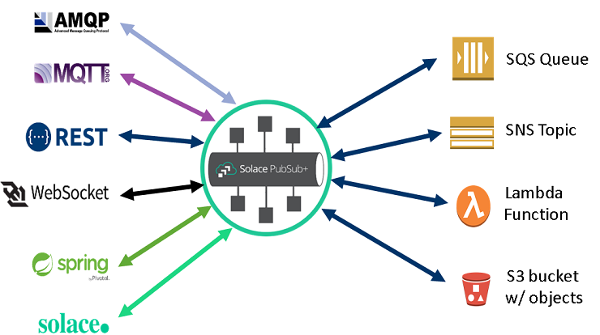


### Tying AWS into the PubSub+ Event Mesh

This AWS integration solution allows any event from any service in the Solace PubSub+ Event Mesh to be captured in an SQS queue, SNS topic, or S3 bucket or to invoke a Lambda function. Any service in the Event Mesh can create the event and events are all potentially available to AWS services.

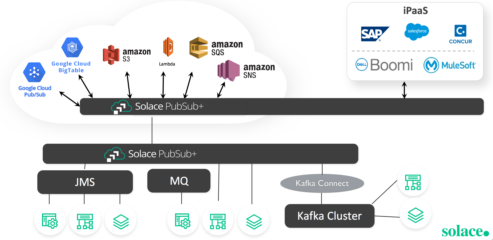


### Eliminating the Need for Separate Integrations

With this AWS integration, you no longer have to code end-applications to reach individual public cloud services. You also don't need bespoke bridges or gateways that have to be made resilient, maintained, and operated.

## Design

This solution uses the [Amazon AWS API Gateway](https://aws.amazon.com/api-gateway) as a proxy.

There are two options provided:

* **Private Integration**: uses a *private integration point* with the AWS API Gateway in a VPC that is not reachable over the public internet. We recommend this option if you have already deployed or are planning to deploy PubSub+ event brokers in AWS.
* **Public Integration**: uses a secured *publicly available integration point* with the AWS API Gateway. We recommend this option mainly for PubSub+ event broker deployments outside AWS.

These options are described in more detail following the discussion of the high level data flow that is applicable to both.

### High Level Data Flow

The following diagram shows the high level flow of data, from left to right:


1. A messages comes into the PubSub+ event broker through one of various open messaging protocols and is placed into a [PubSub+ Queue](https://docs.solace.com/Features/Endpoints.htm#Queues)
1. A [REST Delivery Point (RDP)](https://docs.solace.com/Configuring-and-Managing/Managing-RDPs.htm ) within the event broker takes the message and sends it in an HTTP POST request.
1. The AWS API Gateway has a [Webhook](https://en.wikipedia.org/wiki/Webhook ) interface that consumes the REST call and injects it into the AWS application integration service in a natural AWS call.

This system allows for data retrieval in the reverse direction as well deleting consumed data in AWS.

The advantage of this design is that the movement of data from the open messaging protocol up to the AWS APIGateway all happens within the PubSub+ event broker—no added bridges, gateways, or 3rd party plug-ins are required. This data is treated with the same priority, reliability, and performance as all Solace PubSub+ enterprise messaging.


### Private Integration Option

In this option, the PubSub+ event broker is deployed in AWS, in the same VPC as the API Gateway. Other than AWS policies, no additional security is required to prevent unauthorized use of the gateway.

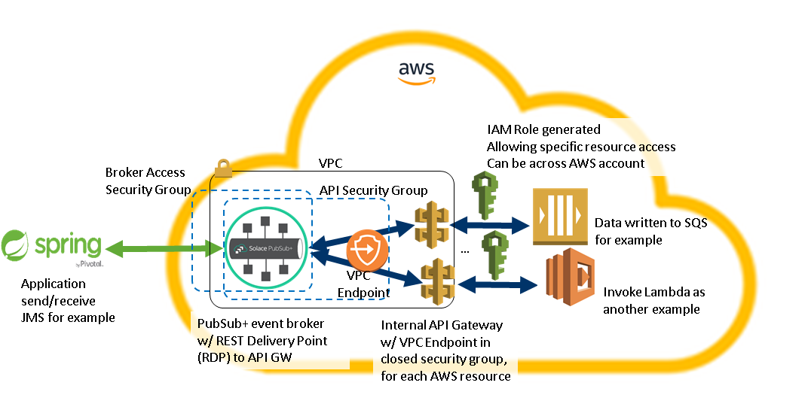

Components:

1. [VPC](https://docs.aws.amazon.com/vpc/latest/userguide/what-is-amazon-vpc.html)—Assumed to be already in place. The VPC provides the private networking layer for the private integration solution. It includes one or more subnets depending on the number of availability zones.
1. PubSub+ event broker with RDP—For production use, a production-ready HA deployment is recommended outside the solution using the [PubSub+ AWS HA Quickstart]( https://github.com/SolaceProducts/pubsubplus-aws-ha-quickstart), which can also set up a new supporting VPC. For development or proof-of-concept purposes, this solution can optionally deploy a new non-HA event broker if there is no PubSub+ event broker already in the VPC. For all cases, the solution includes a sample shell configuration script to properly configure the RDP on the event broker.
1. API Gateway—Defined within the solution. Converts the PubSub+ event broker provided message to a signed REST call formatted for the target downstream resource (SQS, SNS, S3, Lambda). The gateway is set up to use a "Private" integration through the "VPC Endpoint" component. Note that a dedicated gateway is set up for each AWS resource integration.
1. VPC Endpoint—Defined within the solution. Provides a private interface between the VPC and the API Gateway from the defined subnet(s) only.
1. Broker Access Security Group—enables data access to the event broker. It can be configured to enable access from within AWS or provide external access, e.g., for the purpose of forming an event mesh with brokers inside and/or outside AWS.
1. API Security Group—Defined within solution. Allows only the event broker (or in case of HA, all member nodes) to communicate with the API Gateway through the VPC Endpoint.  Inbound access (to the VPC Endpoint) is only allowed from a special "Broker Member Nodes" security group, no IPs or other credentials.
1. IAM Role for the AWS Resource—Defined within solution. Allows read/write access to the specific downstream resource, can be across accounts.
1. AWS Resource—In this example, an SQS Queue or a Lambda function is outside the scope of this solution and is assumed to pre-exist. The API Gateway can write to a specific object or read from it.

As a one-time action, the solution needs to create a "private integration base" that is common for all resource integrations, which consists of setting up the VPC Endpoint and the API Gateway Security Group. Then, for each AWS resource integration, the solution will set up a dedicated API Gateway and IAM Role for the AWS Resource.

### Public Integration Option

In this option the PubSub+ event broker is deployed outside AWS. Because the API Gateway access point is public, the event broker adds a custom Authorization header with a pre-defined Token to the HTTP REST request to ensure authorized use. The gateway first forwards the request context that includes the Token to a Lambda Authorizer, which checks the Token against a valid value and returns an "Allow" or "Deny" policy for further processing.

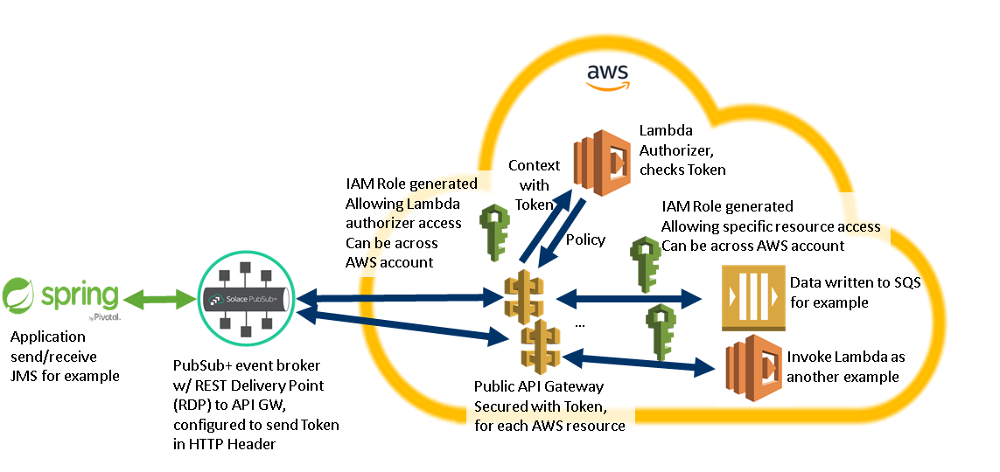

1. PubSub+ event broker—Assumed to already exist. The solution provides a configuration script to setup the RDP with HTTP Header Authentication Scheme to convey the authorization token as described above.
1. API Gateway—Defined within solution, a dedicated gateway is set up for each AWS resource integration. Invokes the Lambda Authorizer; if an "Allow" policy is returned the gateway converts the PubSub+ event broker provided message to a signed REST call formatted for the target downstream resource (SQS, SNS, S3, Lambda). The integration Endpoint Type is set to allow public access. 
Note: In a later API Gateway release, [API keys](https://docs.aws.amazon.com/apigateway/latest/developerguide/api-gateway-setup-api-key-with-console.html ) will additionally be used for traffic control purposes. 
1. Lambda Authorizer—The solution can use an existing Lambda authorizer or create a sample one.
1. IAM Role for the Lambda Authorizer—Generated as part of the solution. Allows invocation of the Lambda Authorizer.
1. IAM Role for the AWS Resource—Defined within solution. Allows read/write access to the specific downstream resource. Can be across accounts.
1. AWS Resource—In this example, an SQS Queue or a Lambda function is outside the scope of this solution and is assumed to pre-exist. The API Gateway can write to a specific object or read from it.

## Integration use examples

### Integration with SQS

The expected message pattern might be to send messages to an SQS queue and receive messages from an SQS queue.  In reality the message pattern will likely be:
1.  Send messages from Solace event mesh to an SQS queue.
2.  Poll an SQS queue for messages eligible for delivery and receive these messages.
3.  Delete each delivered message that has been successfully consumed.

If a message has been delivered but not yet deleted it has change status from eligible-for-delivery to in-flight.  From here it can either be explicitly deleted with a delete message or moved back to eligible-for-delivery after the delete timeout, which by default is 15 seconds.

To send and receive messages to/from an SQS queue, you will need an existing queue.  The ARN for the queue can be found from the AWS console by looking at the SQS queue details and will be of the form:

    arn:aws:sqs:<aws region>:<aws accountId>:<queue name>

For messages intended for the SQS queue, the binary attachment of the message is sent to the AWS queue. Custom headers are not passed to SQS.

For receiving messages from an SQS queue, a request/reply pattern should be used if the sending protocol supports it. The reply includes the message payload, message payload MD5, and the ReceiptHandle. The ReceiptHandle must be the only element in the delete message body and the reply must be sent within 15 seconds of the initial delivery or the message will be re-queued within SQS for delivery. If the receiving protocol does not support request/reply, then a monitoring application can asynchronsously receive the data gathered by polling and then subsequently delete it.

Here is an example exchange pattern:

    Send Message
    pubSubTools/sdkperf_c -cip="${publicIp}" -ptl=pubsubplus-aws-service-integration/send -mr=1 -mn=1 -pal messageBody

    Receive Message
    pubSubTools/sdkperf_c -cip="${publicIp}" -stl=pubsubplus-aws-service-integration/receive/reply -ptl=pubsubplus-aws-service-integration/receive -prp=/reply -mr=1 -mn=1 -md

    Extract the ReceiptHandle from the received message ReceiptHandle and delete from queue
    pubSubTools/sdkperf_c -cip="${publicIp}" -ptl=pubsubplus-aws-service-integration/delete -mr=1 -mn=1 -pal ReceiptHandle

### Integration with S3

This solution only writes messages to an S3 bucket; it does not read messages from an S3 bucket.

The S3 ARN can be obtained from AWS services page using the "Copy ARN" button for the selected bucket name. The ARN takes the following form:

    arn:aws:s3:::<bucket-name>

The S3 bucket cannot be set up to block all public access, at least "Block public access to buckets and objects granted through any access control lists (ACLs)" must be set to "Off"

The message from the event broker is written to the bucket un-altered with a generated GUID as the file name.

### Integration with SNS

The expected message pattern might be to asynchronously send and receive messages from an SNS Topic. This is exactly how this integration works. Sending messages works in the same manner as SQS or S3.  The body of the Solace message is written to the SNS topic.

To receive messages, you must subscribe the Solace event broker to the SNS topic. This causes any matching SNS messages to be asynchronously pushed to Solace on the configured topic. From this point a consumer app can subscribe and receive any SNS published messages.

For the given topic, add a new HTTP(S) subscription. Enter the Solace event broker EC2 IP and REST port, and append the topic the received messages will be published on. In this example it is `test/topic`. Before clicking the __Request confirmation__ button, subscribe to `test/topic`, the confirmation request process will send a test message to the subscription endpoint. You must manually enter the confimationID from this message back into SNS to confirm the endpoint and receive further messages.


### Integration with Lambda

The expected message pattern might be to send messages to a Lambda function, which performs work on the message data and then returns a result or response. This is exactly how this integration works. A Solace request/reply is used to send data to a Lambda function and return a result. For protocols that do not support request/reply, such as MQTT3.1.1, the function executes but the results of the function execution are lost.  It is possible to set up a monitor to asynchronously receive results, but the request context will be lost. 

To send and receive messages to/from a Lambda function, you must have an existing Lambda function.  The ARN for the function can be found in the AWS console by looking at the Lambda function details. The ARN takes the following form:

    arn:aws:lambda:<aws region>:<aws accountId>:function:<function name>

Here is an example exchange pattern:

    Send Message and receive reply
    echo "{\"a\":1,\"b\":2,\"op\":\"+\"}" > request.file
    pubSubTools/sdkperf_c -cip="${publicIp}" -pal=request.file -stl=pubsubplus-aws-service-integration/send/reply -ptl=pubsubplus-aws-service-integration/send -prp=/reply -mr=1 -mn=1 -md

## Minimum Resource Requirements

The following table lists the AWS resources deployed by the solution. Please consult the [Amazon VPC Limits](https://docs.aws.amazon.com/AmazonVPC/latest/UserGuide/VPC_Appendix_Limits.html ) and [API Gateway quotas for REST API](https://docs.aws.amazon.com/apigateway/latest/developerguide/limits.html ) pages to ensure that your AWS region is within the range-per-resource limit before launching:

| Resource                   | Private Integration and simple broker<sup>[1](#simplebroker)</sup> | Public Integration |
|----------------------------|--------|--------|
| VPCs                       |   1    |  N/A   |
| Subnets                    |   1<sup>[1](#simplebroker)</sup> |  N/A   |
| EC2 Instances              |   1<sup>[1](#simplebroker)</sup> |  N/A   |
| VPC Endpoints              |   1    |  N/A   |
| Security Groups            |   3    |  N/A   |
| Lambda Authorizer          |  N/A   |   1<sup>[2](#authorizer)</sup>  |
| API Gateways per integration |   1<sup>[3](#gateways)</sup> |   1<sup>[3](#gateways)</sup> |

Notes - 
[1]: Refer to the [PubSub+ AWS HA Quickstart]( https://github.com/SolaceProducts/pubsubplus-aws-ha-quickstart#minimum-resource-requirements ) for HA setup requirements
[2]: Can range from one common authorizer to one authorizer per gateway
[3]: One gateway for each AWS resource integration

#### Required IAM Roles

Followings are the required roles the template user must be assigned to, in order to setup the integrations: 

Default Group Policies
```
AmazonEC2FullAccess
AmazonS3FullAccess
AmazonSQSFullAccess
AmazonSNSFullAccess
AmazonLambdaFullAccess
```

Additional Policies
```
AmazonAPIGatewayAdministration
AmazonAPIGatewayInvokeFullAccess
AmazonAPIGatewayPushToCloudWatchLogs
AWSCloudFormationReadOnlyAccess
IAMReadOnlyAccess
```

Additional individual permissions
```
"cloudformation:CreateStack*",
"cloudformation:GetTemplateSummary",
"cloudformation:DeleteStack",
"iam:AddRoleToInstanceProfile",
"iam:CreateInstanceProfile",
"iam:CreateRole",
"iam:CreatePolicy",
"iam:PutRolePolicy",
"iam:PassRole",
"iam:DeleteRole",
"iam:DeletePolicy",
"iam:DeleteRolePolicy",
"iam:DeleteInstanceProfile",
"iam:RemoveRoleFromInstanceProfile",
"logs:PutRetentionPolicy",
"logs:DeleteLogGroup"
```

## Solution Deployment Options

The solution is deployed via CloudFormation templates. Specific templates are provided for each deployment option. The templates create nested stacks with substacks representing above described components.

#### Option 1: Private Integration Deployment: Non-Production

The following steps create a service integration with a single PubSub+ Event Broker which is suitble for proof-of-concept purposes only.  This option uses a private VPC integration.  There are two steps; first step creates the event (if needed) and add the security links between the event broker and the API Gateway, then next step adds API Gateway and links to the AWS services that need to
be accessed.

Step 1: Set up the private integration base:
  * If there is no event broker already in the VPC, [set up the private integration base and new simple broker](#setting-up-a-private-integration-base-with-an-existing-event-broker).
  * If there is an existing event broker in the VPC, [set up the private integration base with an existing broker](#setting-up-a-private-integration-base-and-a-new-simple-event-broker).
  
Step 2: For each resource integration, [set up a private resource integration](#setting-up-a-private-resource-integration).

#### Option 2: Private Integration Deployment: Production

The following steps create a service integration with a highly available set of PubSub+ Event Brokers which is suitable for production. This option uses a private VPC integration.  There are three steps; first set up the Highly Available PubSub+ Event Brokers, the second step adds the security link between the event brokers and the API Gateway, then finally add the AWS services that need to be accessed as resources on the API Gateway.

Step 1: Create a production deployment of an HA event broker group with an existing or new VPC. Follow the instructions in the [PubSub+ AWS HA Quickstart]( https://github.com/SolaceProducts/pubsubplus-aws-ha-quickstart#how-to-deploy-pubsub-software-event-broker-in-an-ha-group ).

Step 2: [Set up the private integration base with an existing broker](#setting-up-a-private-integration-base-with-an-existing-event-broker).

Step 3: For each resource integration, [set up a private resource integration](#setting-up-a-private-resource-integration).

#### Option 3: Public Integration Deployment

The following step creates a service integration with an existing PubSub+ Event Broker that doesn't need to be deployed in AWS or in a particular VPC. The only requirement is access from the broker node(s) to public DNS and IPs. 

Step 1: For each public resource integration, [set up a public resource integration](#setting-up-a-public-resource-integration).

### Deployment Step Details

**Important:** AWS is currently using a server certificate with certificate chain depth larger than 3. The default PubSub+ [broker settings for accepted certificate chain depth for REST Delivery Points of the message-vpn used](https://docs.solace.com/Solace-CLI/CLI-Reference/VMR_CLI_Commands.html#Root_enable_configure_message-vpn_rest_ssl_server-certificate-validation_max-certificate-chain-depth) is 3. It must be ensured that this setting is updated to at least 4 through the [CLI](https://docs.solace.com/Solace-CLI/Using-Solace-CLI.htm), [SEMP API](https://docs.solace.com/SEMP/Using-SEMP.htm) or [PubSub+ Broker Manager](https://docs.solace.com/Solace-PubSub-Manager/PubSub-Manager-Overview.htm). The [`setup-rdp.sh` script in this quick start](#step-4-configure-the-broker) includes a step to take care of this.

#### Setting up a private integration base with an existing event broker

* Use the `private_proxy_base.template`.

<a href="https://console.aws.amazon.com/cloudformation/home#/stacks/new?stackName=Private-Proxy-Base&templateURL=https://solace-products.s3.us-east-1.amazonaws.com/pubsubplus-aws-service-integration/latest/templates/private_proxy_base.template" target="_blank">
    
</a>
<a href="https://github.com/SolaceProducts/pubsubplus-aws-service-integration/blob/master/templates/private_proxy_base.template" target="_blank">
    
</a>

Pre-requisites: existing VPC and Subnet within VPC, as well as an existing PubSub+ HA or non-HA event broker deployed in VPC.

| Parameter label (name)     | Default   | Description                                                        |
|----------------------------|-----------|--------------------------------------------------------------------|
| **Private Proxy Base Config with Existing PubSub+ Event Broker** | |                                                                     |
| VPC ID (VpcId) | _Requires_ _input_ | The VPC to be used for the private integration deployment |
| PubSub+ Broker Instances Subnets (SubnetIDs) | _Requires_ _input_ | Subnets where event broker instances have been deployed and where the API Gateway will be accessed from. Use private subnets for production deployment (select all applicable) |
| Broker Member Nodes Security Group (BrokerMembersSecurityGroupId) | _Optional_ | Provide the internal SG generated by the pubsubplus-aws-ha-quickstart (locate the `BrokerMemberNodesSecurityGroup` output from base Solace stack). It allows inbound traffic from the event broker member node (or nodes in case of HA deployment) only. It will be used to enable access from the members to the API Gateway through the VPC endpoint. If not provided, a new SG will be created as an output of this template, which must be added manually to the broker members. (select from the list) |
| **Cloudformation template configuration** | |                                                                     |
| Quick Start S3 Bucket Name (QSS3BucketName) | solace-products | S3 bucket where the Quick Start templates and scripts are installed. Change this parameter to specify the S3 bucket name you've created for your copy of Quick Start assets, if you decide to customize or extend the Quick Start for your own use. |
| Quick Start S3 Key Prefix (QSS3KeyPrefix) | pubsubplus-aws-service-integration/latest/ | Specifies the S3 folder for your copy of Quick Start assets. Change this parameter if you decide to customize or extend the Quick Start for your own use. |

This template creates a nested stack with "SecurityGroupStack", "EndPointStack" as sub-stacks.

It is recommended to provide an existing "Broker Member Nodes Security Group" as a parameter (can be obtained from the existing broker deployment), which will result in automatic setup of the correct access to the API Gateway through the VPC endpoint. If not provided then a manual step is required to add the created security group from this template to each EC2 instance of the existing broker deployment.

#### Setting up a private integration base and a new simple event broker

* Use `private_proxy_base_and_simple_broker.template`

<a href="https://console.aws.amazon.com/cloudformation/home#/stacks/new?stackName=Private-Proxy-Base-And-Solace-Broker&templateURL=https://solace-products.s3.us-east-1.amazonaws.com/pubsubplus-aws-service-integration/latest/templates/private_proxy_base_and_simple_broker.template" target="_blank">
    
</a>
<a href="https://github.com/SolaceProducts/pubsubplus-aws-service-integration/blob/master/templates/private_proxy_base_and_simple_broker.template" target="_blank">
    
</a>

Pre-requisites: existing VPC and Subnet within VPC. It is recommended to have a Security Group setup to control external access to the broker.

| Parameter label (name)     | Default   | Description                                                        |
|----------------------------|-----------|--------------------------------------------------------------------|
| **Private Proxy Base configuration** | |                                                                     |
| VPC ID (VpcId) | _Requires_ _input_ | ID of the VPC to be used for the deployment. |
| **PubSub+ Event Broker Parameters** | |                                                                     |
| Broker Admin Password (AdminPassword) | _Requires_ _input_ | Password to access PubSub+ admin console and SEMP. |
| SSH Key Name (KeyPairName) | _Requires_ _input_ | The name of an existing public/private key pair which allows you to securely connect to the broker EC2 instance after it launches. |
| Broker Node Instance Type (NodeInstanceType) | _Requires_ _input_ | Type of EC2 instance for the PubSub+ event broker. |
| Subnet To Be used (SubnetId) | _Requires_ _input_ | VPC Subnet ID where the broker instance will be deployed and where the API Gateway will be accessed from. |
| External Access Security Group (ExternalAccessSecurityGroupID) | _Optional_ | A SG within the selected VPC, which defines the inbound rules for the broker to be created (select from the list). If not provided, a new SG will be created, initialized to allow any inbound traffic. |

This template creates a nested stack with "SecurityGroupStack", "EndPointStack" and "SolaceStack" as sub-stacks.

To determine the IP address or public DNS hostname of the created broker, go to the "SolaceStack" in the AWS CloudFormation service console, then under the "Resources" tab locate the "BrokerNodeInstance" link, which brings to the EC2 Instance details page. You can access the broker for configuration at port 8080 (check that the External Access Security Group allows inbound traffic). 

#### Setting up a private resource integration

* Use `private_resource_integration.template` to create the stack

<a href="https://console.aws.amazon.com/cloudformation/home#/stacks/new?stackName=Private-Resource-Integration&templateURL=https://solace-products.s3.us-east-1.amazonaws.com/pubsubplus-aws-service-integration/latest/templates/private_resource_integration.template" target="_blank">
    
</a>
<a href="https://github.com/SolaceProducts/pubsubplus-aws-service-integration/blob/master/templates/private_resource_integration.template" target="_blank">
    
</a>

| Parameter label (name)     | Default   | Description                                                        |
|----------------------------|-----------|--------------------------------------------------------------------|
| **Resource parameters** | |                                                                     |
| AWS Resource Type (ResourceType) | _Requires_ _input_ | The type of AWS Resources this integration will proxy. Select SQS, SNS, S3 or Lambda from the list. |
| AWS Resource ARN (ResourceARN) | _Requires_ _input_ | The AWS ARN associated with resource, for example: arn:sqs:myQueue |
| Non-default S3 region, ignored for other AWS resource (S3ResourceNonDefaultRegion) | _Optional_ | Specify the region if integrating an S3 that is in a different region than the current deployment. Leave it blank otherwise. |
| **Integration Environment Parameters** | |                                                                     |
| VPC Id (VpcId) | _Requires_ _input_ | ID of the target VPC where the integration will be deployed.  |

This template creates a nested stack with "RoleStack" and a proxy stack, named depending on the target resource type as either "SQSStack", "SNSStack", "LambdaStack", or "S3Stack", as sub-stacks.

* Run `setup-rdp.sh` script to configure RDP on the PubSub+ broker

One of the script parameters is `INTEGRATION_API_URL`, which can be obtained from the output of the proxy sub-stack, created above. For SQS integration, run the script three times to configure access to all three APIs as in the example; for other integrations run the script only for the `send` API.

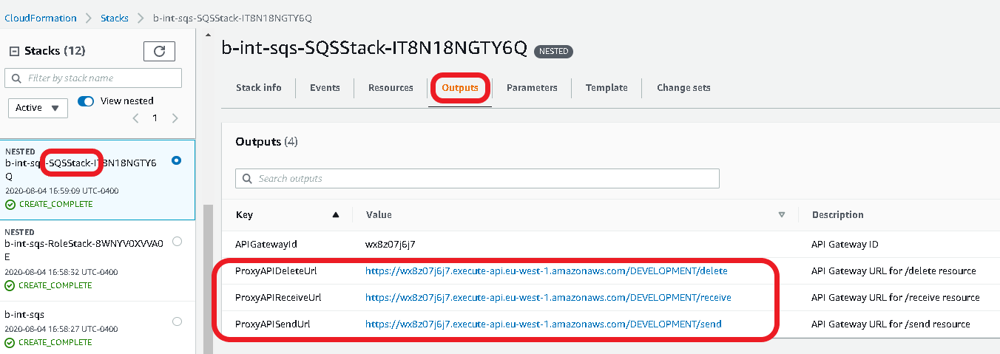

The script is located under the `scripts` directory in this GitHub repo. Download the script and run it as follows, providing at least the mandatory parameters (that are not in `[]` brackets. 

```
wget https://raw.githubusercontent.com/SolaceProducts/pubsubplus-aws-service-integration/master/scripts/setup-rdp.sh
chmod +x setup-rdp.sh
INTEGRATION_NAME=<name to be used to identify this AWS resource integration> \
  INTEGRATION_API_URL=<the full URL to the API in the API Gateway. Example: https://wx8z07j6j7.execute-api.eu-west-1.amazonaws.com/DEVELOPMENT/send> \
  BROKER_SEMP_URL=<the full management access URL for the event broker to be configured> \
  ADMIN_PASSWORD=<the managemnt admin user password> \
  [ADMIN_USERNAME=<the managemnt admin username, default is 'admin'>] \
  [BROKER_MESSAGE_VPN=<the message VPN to setup, default is 'default'>] \
  setup-rdp.sh
```

Note: `setup-rdp.sh --help` will provide help. The script has a dependency on the `xmllint` tool and it will provide help how to set it up if not installed.

The script will [setup a PubSub+ queue](https://docs.solace.com/Solace-Cloud/ggs_queue.htm), which represents the target AWS resource. There will also be a PubSub+ topic created that is mapped to the queue, so either publishing to the topic or the queue will result in sending the message contents to the target AWS resource. An associated RDP will also be created and configured.

#### Setting up a public resource integration


* Use `public_resource_integration.template`

<a href="https://console.aws.amazon.com/cloudformation/home#/stacks/new?stackName=Public-Resource-Integration&templateURL=https://solace-products.s3.us-east-1.amazonaws.com/pubsubplus-aws-service-integration/latest/templates/public_resource_integration.template" target="_blank">
    
</a>
<a href="https://github.com/SolaceProducts/pubsubplus-aws-service-integration/blob/master/templates/public_resource_integration.template" target="_blank">
    
</a>

| Parameter label (name)     | Default   | Description                                                        |
|----------------------------|-----------|--------------------------------------------------------------------|
| **Target AWS Resource Parameters** | |                                                                     |
| AWS Resource Type (ResourceType) | _Requires_ _input_ | The type of AWS Resources this integration will proxy. Select SQS, SNS, S3 or Lambda from the list. |
| AWS Resource ARN (ResourceARN) | _Requires_ _input_ | The AWS ARN associated with resource, example arn:sqs:myQueue |
| Non-default S3 region, ignored for other AWS resource (S3ResourceNonDefaultRegion) | _Optional_ | Specify the region if integrating an S3 that is in a different region than current deployment. Leave it blank otherwise. |
| **Authorization Parameters** | |                                                                     |
| HTTP Authorization Header Name (AuthHTTPHeaderName) | _Requires_ _input_ | Field name of the PubSub+ RDP HTTP request header used for authorization. |
| Existing Lambda Authorizer ARN (ExistingLambdaAuthorizerARN) | _Optional_ | Provide an existing Lambda authorizer ARN to be used. If not provided, a new Lambda authorizer will be created for this integration with logic checking for "HTTP Authorization Token Value" parameter. |
| HTTP Authorization Token Value (AuthHTTPHeaderValue) | _Optional_ | Expected value of the PubSub+ RDP HTTP request header used for authorization.  Will be ignored if existing Lambda authorizer parameter is provided. |

This template creates a nested stack with "RoleStack" and a proxy stack, named depending on the target resource type as either "SQSStack", "SNSStack", "LambdaStack", or "S3Stack", as sub-stacks.

Additionally, a new "LambdaAuthorizationStack" will be created if no Existing Lambda Authorizer ARN parameter has been provided. It sets up a simple trivial Lambda authorizer, which can be potentially reused for subsequent resource integrations. Review the [AWS API Gateway Lambda authorizer documentation](https://docs.aws.amazon.com/apigateway/latest/developerguide/apigateway-use-lambda-authorizer.html#api-gateway-lambda-authorizer-create) to develop a more complex authorizer.

* Run `setup-rdp.sh` script to configure RDP on the PubSub+ broker

This is similar to the script execution for private integration setup, see additional details there.

The difference is that `HTTP_AUTH_HEADER_NAME` and `HTTP_AUTH_TOKEN_VALUE` parameters are additionally required, the same values as used for the parameters in the `public_proxy_integration.template`.

```
#wget https://github.com/SolaceProducts/pubsubplus-aws-service-integration/blob/master/scripts/setup-rdp.sh
wget https://raw.githubusercontent.com/SolaceProducts/pubsubplus-aws-service-integration/master/scripts/setup-rdp.sh
chmod +x setup-rdp.sh
INTEGRATION_NAME=<name to be used to identify this AWS resource integration> \
  INTEGRATION_API_URL=<the full URL to the API in the API Gateway. Example: https://wx8z07j6j7.execute-api.eu-west-1.amazonaws.com/DEVELOPMENT/send> \
  BROKER_SEMP_URL=<the full management access URL for the event broker to be configured> \
  ADMIN_PASSWORD=<the management admin user password> \
  HTTP_AUTH_HEADER_NAME=<for public integration, the HTTP Authorization Header name> \
  HTTP_AUTH_TOKEN_VALUE=<for public integration, the HTTP Authorization Token value> \
  [ADMIN_USERNAME=<the management admin username, default is 'admin'>] \
  [BROKER_MESSAGE_VPN=<the message VPN to setup, default is 'default'>] \
  setup-rdp.sh
```

## Quick Start

This is a step-by-step guide to achieve an example integration for demo purposes. It focuses on the required steps, more details are provided in other sections of this document.

The example demonstrates the setup of a private integration to an AWS S3 bucket, so events published to a PubSub+ queue results in data sent to an S3 bucket.

#### Step 1: Setup pre-requisites

Launch following two templates in your test AWS region, no parameters are required. Click through the "Next" buttons and acknowledge creation of IAM resources if asked.

* Create a sample VPC and within that a Subnet and Security Group

<a href="https://console.aws.amazon.com/cloudformation/home#/stacks/new?stackName=Sample-VPC&templateURL=https://solace-products.s3.us-east-1.amazonaws.com/pubsubplus-aws-service-integration/latest/templates/SetupSampleEnvironment/setup_sample_new_vpc_for_private_integration.template" target="_blank"></a>

Locate and note the "VPC", "Subnet" and "SecurityGroup" outputs of the template, which will be used for the next steps:

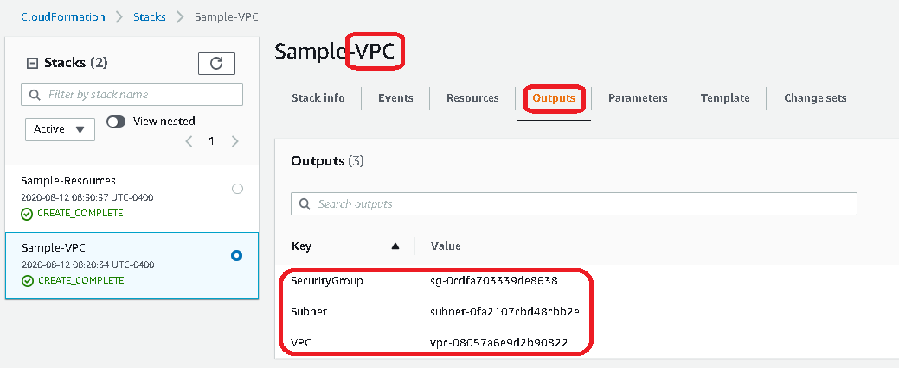

* Create sample AWS SQS, SNS, S3 and Lambda resources

<a href="https://console.aws.amazon.com/cloudformation/home#/stacks/new?stackName=Sample-Resources&templateURL=https://solace-products.s3.us-east-1.amazonaws.com/pubsubplus-aws-service-integration/latest/templates/SetupSampleEnvironment/setup_sample_aws_resources.template" target="_blank"></a>

Note the "TestS3Bucket" output of the template. The ARN is `arn:aws:s3:::sample-resources-tests3bucket-1clsl6kkrir7`, from which the S3 bucket name is `sample-resources-tests3bucket-1clsl6kkrir7`:

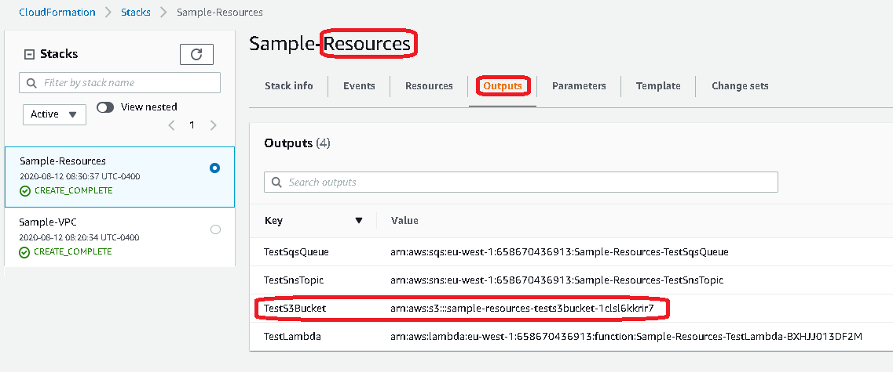

#### Step 2: Create private integration base

This template will create the base for integration together with a PubSub+ broker instance deployed.

Provide the required parameters, for example `admin` as "Broker Admin Password", your "SSH Key Name", leave "Broker Node Instance Type" at default, then use the VPC, Subnet and Security Group (for the Optional External Access Security Group) from [Step 1](#step-1-setup-pre-requisites). No need to change the "CloudFormation template configuration" parameters. Again, click through all the "Next" buttons and acknowledge creation of IAM resources.

<a href="https://console.aws.amazon.com/cloudformation/home#/stacks/new?stackName=Sample-IntegrationBaseWithBroker&templateURL=https://solace-products.s3.us-east-1.amazonaws.com/pubsubplus-aws-service-integration/latest/templates/private_proxy_base_and_simple_broker.template" target="_blank"></a>

The output of the template will provide the public DNS name of the deployed broker:

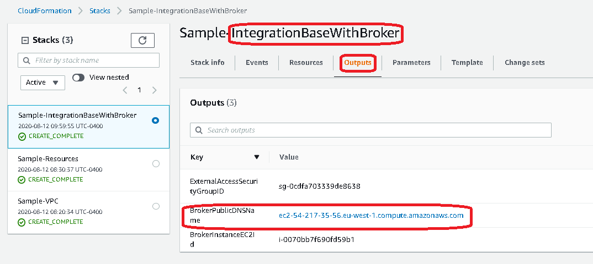

#### Step 3: Setup the integration

This template will create a dedicated AWS API Gateway to the target resource.

Select S3 as the resource, and provide the S3 resource ARN and the VPC Id from [Step 1](#step-1-setup-pre-requisites). Leave the "Non-default S3 Region" empty as the S3 resource is in the same region as the integration.

<a href="https://console.aws.amazon.com/cloudformation/home#/stacks/new?stackName=Private-Resource-Integration&templateURL=https://solace-products.s3.us-east-1.amazonaws.com/pubsubplus-aws-service-integration/latest/templates/private_resource_integration.template" target="_blank"></a>

The output of the template will provide the REST API URL that can be used to send data to the S3 resource.


#### Step 4: Configure the broker

Download and run the `setup-rdp.sh` script and provide the parameters gathered from the templates. In this example:

```
wget https://raw.githubusercontent.com/SolaceProducts/pubsubplus-aws-service-integration/master/scripts/setup-rdp.sh
chmod +x setup-rdp.sh
# Update with your actual values
INTEGRATION_NAME=my-s3 \
  INTEGRATION_API_URL=https://gxxt1uee3g.execute-api.eu-west-1.amazonaws.com/DEVELOPMENT/send \
  BROKER_SEMP_URL=http://ec2-54-217-35-56.eu-west-1.compute.amazonaws.com:8080 \
  ADMIN_PASSWORD=admin \
  setup-rdp.sh
```

Note: the `BROKER_SEMP_URL` is constructed by default as `http://<public DNS name of the deployed broker>:8080`

#### Testing

* First check the broker has been configured correctly

Login to the broker at the [browser-based administration console](https://docs.solace.com/Solace-PubSub-Manager/PubSub-Manager-Overview.htm): `http://ec2-54-217-35-56.eu-west-1.compute.amazonaws.com:8080` (adjust it to your URL - see the output of [Step 2](#step-2-create-private-integration-base)). In this example login as `admin` user with `admin` as password.

Click on the Message VPN (default) and verify that the Operational State of the created Rest Delivery Point (RDP) is up.

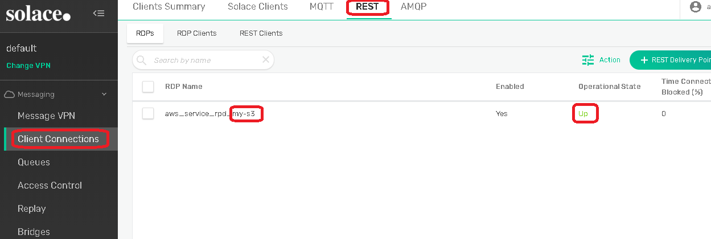

Next, check that a PubSub+ queue has been created, which represents the AWS S3 resource that has just been integrated. In this example the queue name is `aws_service_my-s3_send_queue`:

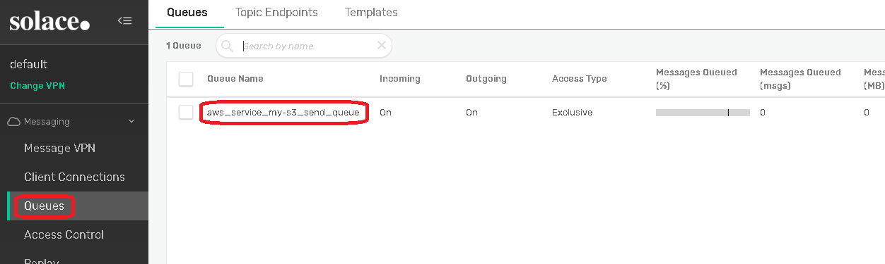

* Now send a test message to this queue and see how it ends up being forwarded to the AWS S3 bucket

One of the simplest options to send a test message is to use the ["Try Me!"](https://docs.solace.com/Solace-PubSub-Manager/PubSub-Manager-Overview.htm#Test-Messages) feature of the administration console:

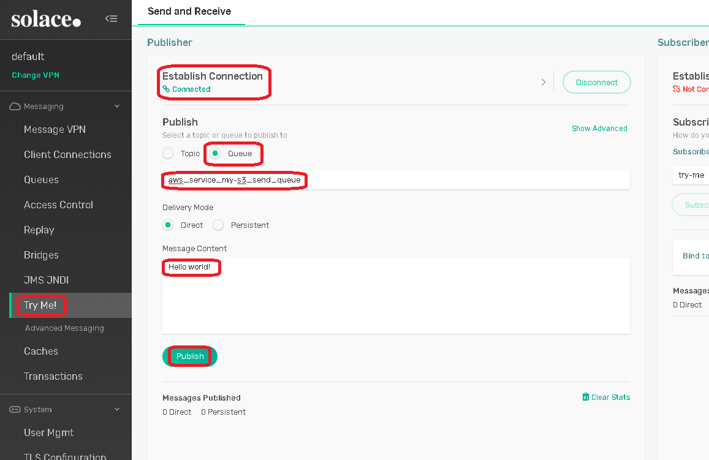

Once the message has been published to the queue, let's check the target S3 bucket. Open the [AWS S3 Console](https://s3.console.aws.amazon.com/s3/home) and locate your bucket (`sample-resources-tests3bucket-1clsl6kkrir7` in this example). A new entry has been created with a unique name with the message contents:

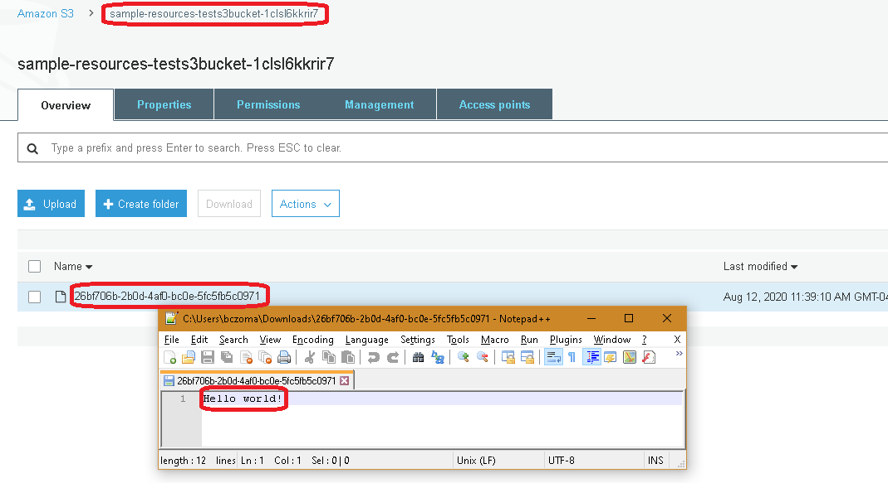

## Troubleshooting Hints

* First ensure that the API Gateway has been setup properly and can reach the target resource internally. Use the AWS "API Gateway" Service console and navigate to the method to be checked, then confirm proper data flow using the "TEST" feature.

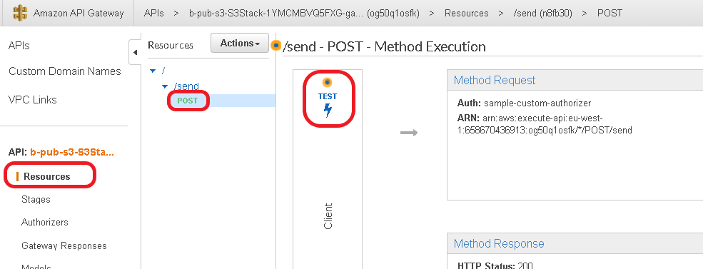

* If using Lambda authorizer, test using the AWS "API Gateway" Service console if the provided token in the header is processed correctly.

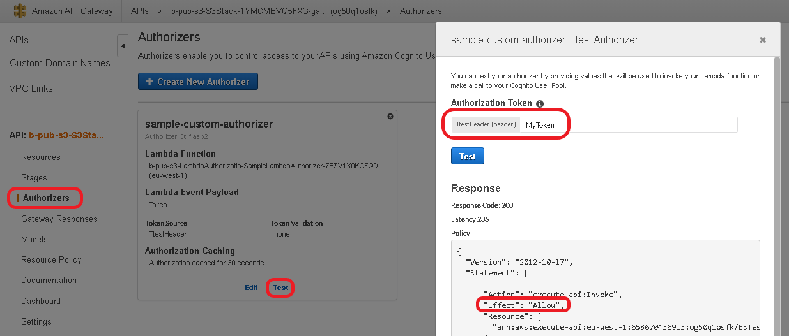

* To inspect message processing details at the API Gateway, [enable CloudWatch Logs](https://aws.amazon.com/premiumsupport/knowledge-center/api-gateway-cloudwatch-logs ). Logs will be available from CloudWatch -> CloudWatch Logs -> Log groups -> &lt;Gateway-specific Log group&gt;. Keep in mind that the default settings for log group contents is "Never expire".


## Contributing

Please read [CONTRIBUTING.md](CONTRIBUTING.md) for details on our code of conduct, and the process for submitting pull requests to us.

## Authors

See the list of [contributors](../../graphs/contributors) who participated in this project.

## License

This project is licensed under the Apache License, Version 2.0. - See the [LICENSE](LICENSE) file for details.

## Resources

For more information about Solace technology in general please visit these resources:

- The [Solace Developers website](https://www.solace.dev/)
- The [Solace Documentation](https://docs.solace.com)
- Understanding [Solace technology]( https://solace.com/products/tech/)
- Ask the [Solace Community]( https://solace.community/)


